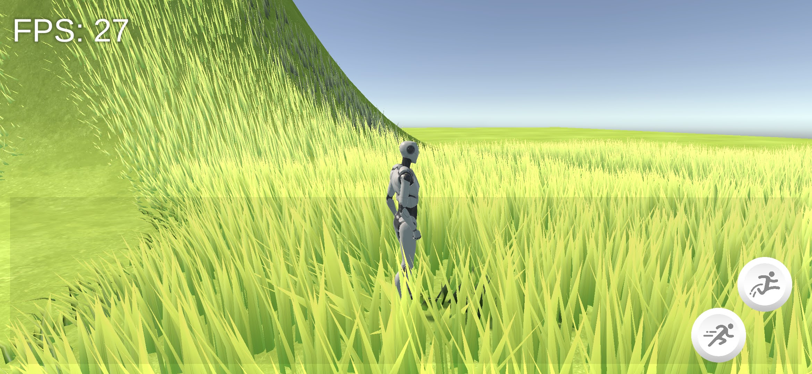
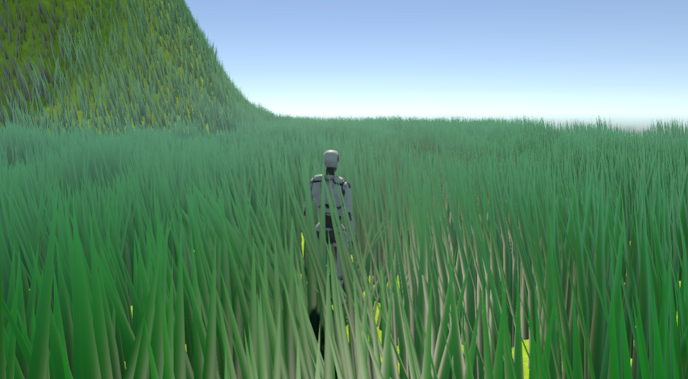
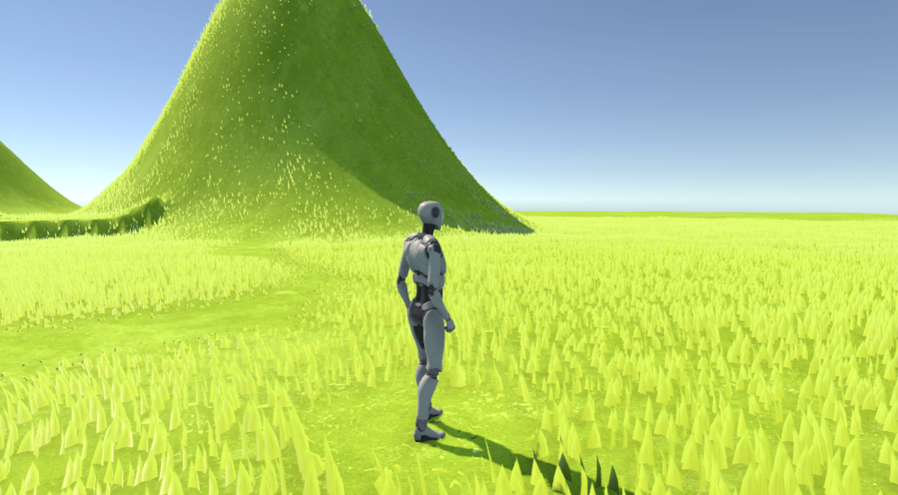
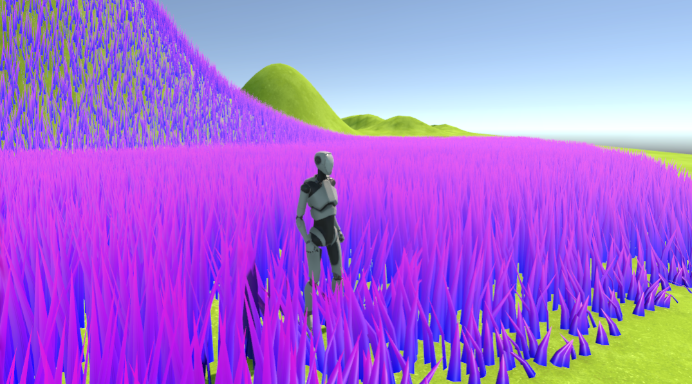
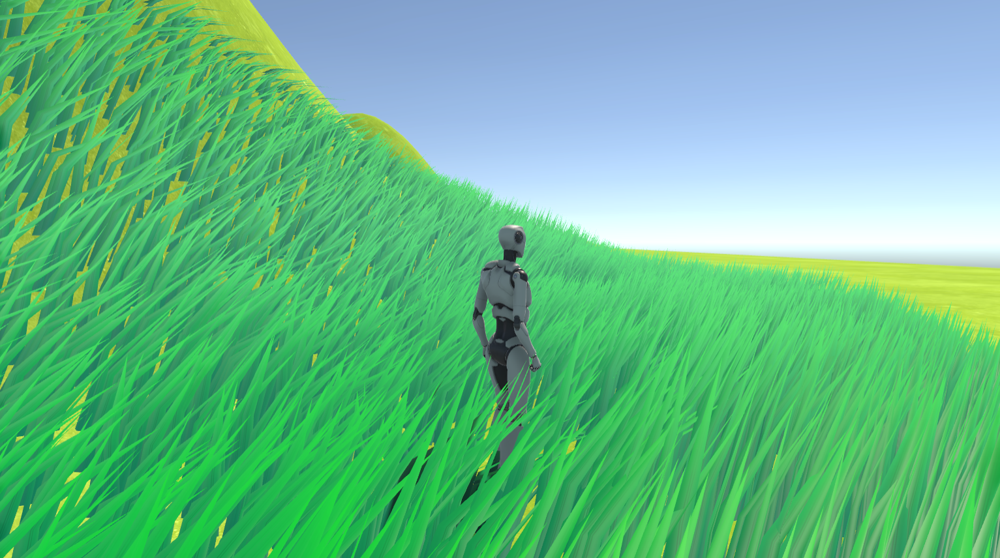

# Grass-FDP-2023
Grass and wind system for Unity with a stylized look for the Final Degree Project in the degree *Videogame Development and Design* at *Universitat Jaume I*.

## Overview

In this project, a grass tool is being developed, centered around **single blade model grass**, utilizing compute shaders to recreate complex natural phenomena such as grass and wind. Scrolling noise is used for static wind and a fluid simulation around the player creates higher detail wind behaviour of certain objects. Object's positions can modify the system as well, using normal textures that follow the entities.

The tool allows the user to specify:

 -  Grass **placement**
 - Grass **density**
 - Grass **LOD distance**
 - Grass **cutoff distance**
 - Top and bottom **colour**
 - **Y Scale**
 -  Minimum and maximum **random scale** values
 - Maximum **Y rotation**
 - **Bend**
 - **Additional bend** (view-dependent)
 - Static **wind strength**
 - Static **wind speed**
 - Static **wind direction**
 - Satic **wind scale**
 - Satic **wind distortion**
 - Dynamic **wind simulation volume**
 - Dynamic **wind strength**
 - Object **position displacement strength**

## System specifications
The system is based on C#, compute shaders and Shader Graph. C# is used to manage grass, grass placement and fluid simulated wind. Compute shaders generate positions, optimize the system and performs the fluid simulation. Shader Graph is used to create the vertex shader which modifies the shape and movement of the grass blades.

The optimization techniques that the system features are: **quadtree world division**, **frustum culling**, **distance culling** and **LOD**. The fluid simulation uses 3D textures used in a similar way to *Santa Monica Studios' Rupert Renard* explanation in [Wind Simulation in God of War](https://www.youtube.com/watch?v=dDgyBKkSf7A&t=1531s&ab_channel=GDC).

## Video trailer

## Example images
Here are some images of what can be achieved with the system.

